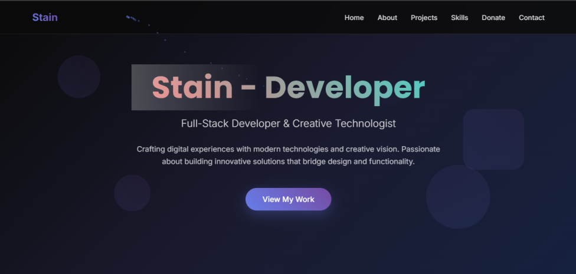

# 💼 Personal Portfolio Website | Trang web Portfolio cá nhân

---

## 🌐 Live Demo | Bản demo trực tiếp
🚀 **Visit / Truy cập:** [https://stainmc2102.vercel.app](https://stainmc2102.vercel.app)

*(Replace with a real screenshot / Thay bằng ảnh chụp thật của trang web)*

---

## 📝 Introduction | Giới thiệu

**EN:**  
This project is a **personal portfolio website** built entirely with **HTML, CSS, and JavaScript** —  
no frameworks, no libraries.  
It features a clean and modern UI with smooth animations, designed to showcase projects, skills, and contact info.  
Deployed easily via **Vercel static hosting**.

**VI:**  
Đây là **trang web portfolio cá nhân** được xây dựng hoàn toàn bằng **HTML, CSS và JavaScript** —  
không dùng bất kỳ framework hay thư viện ngoài nào.  
Trang có thiết kế hiện đại, hiệu ứng mượt mà, dùng để giới thiệu dự án, kỹ năng và liên hệ.  
Triển khai dễ dàng thông qua **Vercel**.

---

## ✨ Features | Tính năng nổi bật

**EN:**
- 🎬 Intro animation before entering the site  
- 💫 Smooth scrolling and fade-in effects  
- 📱 Responsive layout (works on all devices)  
- 🧭 Simple navigation bar  
- ⚡ Fast loading, lightweight  
- ☁️ Deployed manually via upload on Vercel  

**VI:**
- 🎬 Hiệu ứng intro trước khi vào trang chính  
- 💫 Cuộn mượt, hiệu ứng chuyển cảnh  
- 📱 Tương thích hoàn toàn với mọi thiết bị  
- 🧭 Thanh điều hướng tiện dụng  
- ⚡ Tải nhanh, gọn nhẹ  
- ☁️ Triển khai thủ công bằng cách upload lên Vercel  

---

## 🧠 Tech Stack | Công nghệ sử dụng

| Purpose / Mục đích | Technology / Công nghệ |
|---------------------|------------------------|
| Structure / Cấu trúc | HTML5 |
| Styling / Giao diện | CSS3 (Flexbox, Grid, Responsive Design) |
| Interactivity / Hiệu ứng | Vanilla JavaScript |
| Deployment / Triển khai | Vercel |

---

## 📂 Folder Structure | Cấu trúc thư mục

📦 portfolio
┣ 📜 index.html # Main HTML file / File chính
┣ 📜 styles.css # Custom styling / CSS tùy chỉnh
┣ 📜 script.js # JS animations / Hiệu ứng JavaScript
┣ 📜 preview.png # Screenshot preview / Ảnh xem trước
┗ 📜 README.md # Documentation / Tài liệu dự án

---

## ⚙️ Deployment (Vercel Upload) | Hướng dẫn triển khai (Vercel)

**EN:**
1. Go to [https://vercel.com](https://vercel.com)  
2. Click **Add New Project → Upload**  
3. Select your portfolio folder  
4. Click **Deploy**  
5. Done! Your website will be live at `https://yourname.vercel.app`

**VI:**
1. Truy cập [https://vercel.com](https://vercel.com)  
2. Chọn **Add New Project → Upload**  
3. Chọn thư mục chứa project portfolio  
4. Nhấn **Deploy**  
5. Xong! Website của bạn sẽ hoạt động tại `https://tenban.vercel.app`

---

## 🧩 Future Improvements | Cải tiến trong tương lai
- [ ] Add dark/light mode toggle / Thêm chế độ sáng – tối  
- [ ] Add animation on scroll / Hiệu ứng khi cuộn  
- [ ] Add contact form (EmailJS) / Form liên hệ thực tế  
- [ ] Add project filter / Bộ lọc dự án  

---

## 📜 License | Giấy phép
**EN:**  
This project is open-source and free to use for personal or educational purposes.  
You can fork and modify it freely.

**VI:**  
Dự án này là mã nguồn mở, cho phép sử dụng miễn phí cho mục đích cá nhân hoặc học tập.  
Bạn có thể fork và chỉnh sửa thoải mái.

---

> ✨ **Clean • Modern • Responsive**  
> Built with ❤️ using **HTML + CSS + JavaScript**  
> Deployed via **Vercel**
